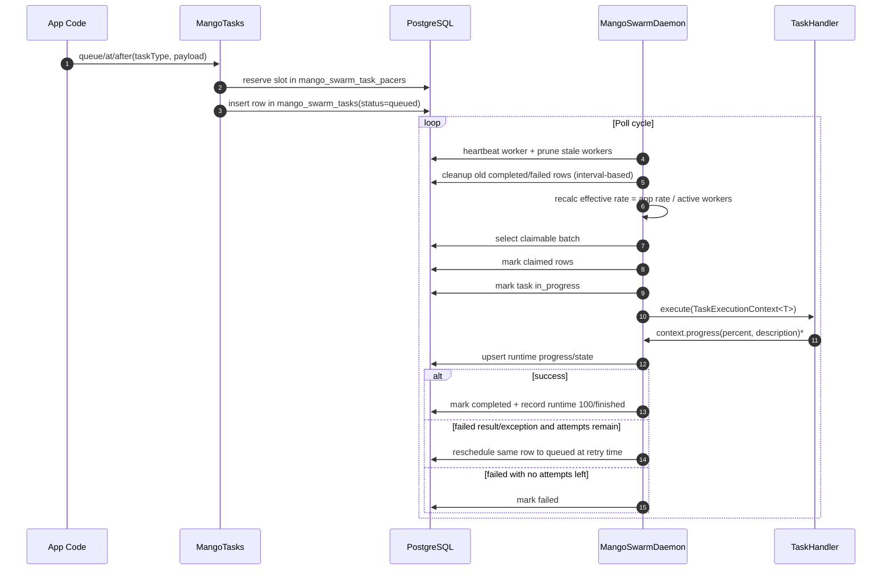
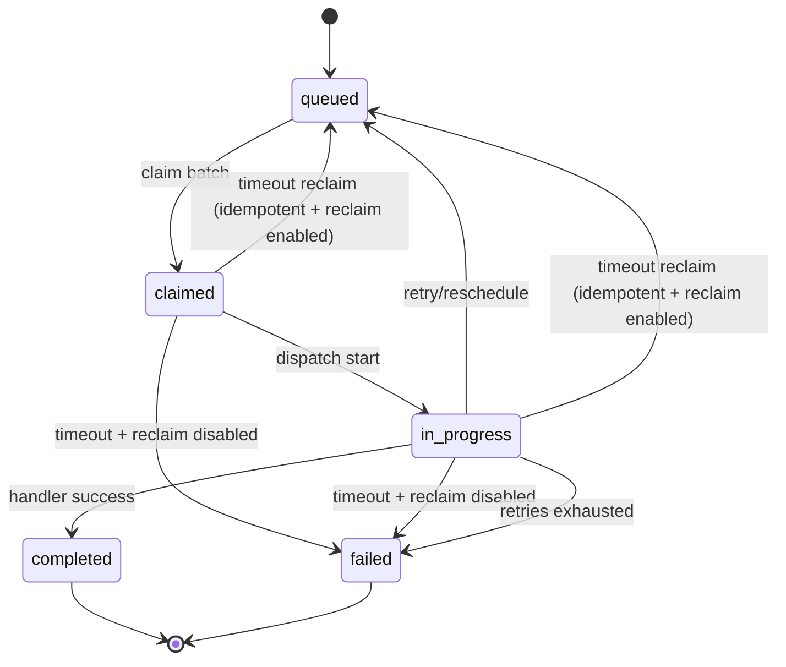

# How mango-swarm Works

This document explains the runtime model of `mango-swarm`, the table interactions, and the control flow from task submission to completion.

## Scope and assumptions

- Multiple instances of the same application can run at the same time.
- All instances support the same configured task types.
- Task payloads are durable JSON (`jsonb`) and can outlive Java POJO versions.
- The application owns schema and table creation. The library does not run migrations from its jar.

## Core components

- `MangoTasks`: high-level API for `queue(...)`, `at(...)`, and `after(...)`.
- `MangoSwarmDaemon`: worker loop that heartbeats, claims, dispatches, retries, reclaims, and cleans up old terminal tasks.
- `TaskHandler<T>`: application task logic.
- `TaskExecutionContext<T>`: metadata + payload + progress reporting callback.
- `TaskRepository`: PostgreSQL persistence contract used by the daemon.
- `WorkerRegistry`: worker heartbeat and active-worker counting.

## Data model

Required tables:

### `mango_swarm_workers`

Worker identity and heartbeat state:

- `worker_id`: worker UUID primary key
- `hostname`: worker host name for diagnostics
- `started_at`: worker start timestamp
- `last_heartbeat_at`: most recent heartbeat timestamp

Workers update this table on each heartbeat. The active worker count used for rate division comes from non-stale rows.

### `mango_swarm_task_pacers`

Per-task-type slot occupancy ledger used for smooth scheduling:

- `task_type`: configured task type
- `slot_at`: reserved execution slot timestamp
- `task_id`: task row linked to the slot
- `created_at`: slot creation timestamp

The primary key is `(task_type, slot_at)`, so each task type has an independent pacing timeline.

### `mango_swarm_tasks`

Durable work item and lifecycle state:

- `id`: task UUID primary key
- `task_type`: configured task type
- `payload`: durable task payload stored as `jsonb`
- `status`: one of `queued`, `claimed`, `in_progress`, `completed`, or `failed`
- `available_at`: earliest claim timestamp
- `claimed_by`: worker UUID that owns the current claim
- `claimed_at`: current claim timestamp
- `attempt_count`: current attempt number
- `created_at`, `updated_at`: durable row timestamps
- `completed_at`, `failed_at`: terminal state timestamps
- `execution_time_ms`: final/current attempt execution time for durable lifecycle transitions
- `last_error_message`: last failure, timeout, or requeue message

This table is intentionally durable and mostly stable. Payloads live here, and frequent progress updates do not.

### `mango_swarm_task_runtime`

Hot mutable runtime state for the current attempt:

- `task_id`: primary key and foreign key to `mango_swarm_tasks(id)` with cascade delete
- `worker_id`: worker UUID currently reporting runtime state
- `execution_state`: current human-readable state, such as `running` or `completed`
- `progress_percent`: optional current progress from `0` to `100`
- `progress_message`: optional human-readable progress message
- `started_at`: attempt start timestamp
- `updated_at`: most recent runtime update and liveness timestamp
- `execution_time_ms`: current elapsed attempt time

This table is narrow, contains no `jsonb`, and uses `fillfactor = 75` so PostgreSQL has room for HOT updates during frequent progress/state changes.

Important indexes:

- `idx_mango_tasks_queue_claim` on queued tasks by `(task_type, available_at, id)` for batch claiming
- `idx_mango_task_runtime_worker` on `(worker_id, task_id)` for runtime visibility by worker
- `idx_mango_tasks_timeout_due` on claimed/in-progress tasks by `(task_type, claimed_at, id)` for timeout recovery
- cleanup indexes on completed and failed terminal timestamps

Reference SQL:

- `documentation/mango-swarm-schema.sql`

## End-to-end runtime flow

`*` progress calls are optional but strongly recommended for long-running handlers.

Runtime table flow:

| Step | Tables | What happens |
| --- | --- | --- |
| Queue task | `mango_swarm_task_pacers`, `mango_swarm_tasks` | `MangoTasks` reserves a per-type slot, then inserts a durable `queued` task row with the JSON payload. |
| Drop task | none | `mode: drop` returns an acknowledgement id without inserting into any swarm table. |
| Reject task | none | `mode: reject` fails before inserting into any swarm table. |
| Worker heartbeat | `mango_swarm_workers` | The daemon upserts its worker row, updates `last_heartbeat_at`, prunes stale workers, and uses the remaining worker count for rate division. |
| Cleanup | `mango_swarm_tasks`, `mango_swarm_task_pacers` | The daemon deletes old terminal task rows and old pacing slots according to cleanup retention settings. |
| Timeout recovery | `mango_swarm_tasks`, `mango_swarm_task_runtime` | The daemon finds claimed or in-progress tasks whose runtime `updated_at` or task `claimed_at` is stale, then either requeues idempotent reclaimable tasks or marks them failed. |
| Claim batch | `mango_swarm_tasks` | The daemon selects due `queued` rows for a task type and updates them to `claimed` with `claimed_by`, `claimed_at`, and incremented `attempt_count`. |
| Start execution | `mango_swarm_tasks`, `mango_swarm_task_runtime` | The worker marks the task `in_progress` and inserts or resets the runtime row with `execution_state = running`, `started_at`, `updated_at`, and `execution_time_ms = 0`. |
| Report progress/state | `mango_swarm_task_runtime` | `TaskExecutionContext` updates only the narrow runtime row with state, progress, liveness, and current elapsed execution time. |
| Complete task | `mango_swarm_tasks`, `mango_swarm_task_runtime` | The worker marks the durable task `completed`, records final task execution time, and writes runtime `completed` / `100` / `finished`. |
| Retry task | `mango_swarm_tasks`, `mango_swarm_task_runtime` | The worker reschedules the same durable row to `queued`, clears claim/runtime lifecycle fields, clears final execution time, and removes runtime state. |
| Fail task | `mango_swarm_tasks`, `mango_swarm_task_runtime` | The worker marks the durable task `failed`, stores `last_error_message` and final execution time, and writes runtime failure state. |

## Task state lifecycle

## Scheduling model

`MangoTasks` schedules by slot spacing derived from task-type `rate` and `period`:

- `slotSpacing = period / rate` (bounded to at least 1ns)

When queueing:

1. Check nearest occupied slot at or before requested time.
2. Check nearest occupied slot after requested time.
3. Move requested time forward only when needed to avoid slot collisions.

Result: a far-future task does not block earlier tasks.

## Distributed rate division

Each task type has app-level rate config. A worker applies:

- `effectiveLocalRate = configuredRate / activeWorkerCount`

`activeWorkerCount` comes from worker heartbeats in `mango_swarm_workers`.

The daemon uses smooth slot pacing and batch claiming, not burst-all-at-once permits.

## Batch claiming and concurrency

For each task type and poll cycle, claim limit is bounded by:

- whether the task type is in `execute` mode
- configured/derived batch size
- remaining local rate capacity
- remaining per-task-type concurrency
- remaining global executor capacity

Task type modes affect both producers and workers:

| Mode | Producer behavior | Worker behavior |
| --- | --- | --- |
| `execute` | inserts new task rows | claims tasks and runs timeout recovery |
| `queue` | inserts new task rows | skips claiming and timeout recovery |
| `reject` | fails before inserting a task row | skips claiming and timeout recovery |
| `drop` | returns an acknowledgement id without inserting a task row | skips claiming and timeout recovery |

Queued rows for non-executing modes remain in `mango_swarm_tasks` and become eligible again when the task type is set back to `mode: execute`.

Claiming uses a portable select-and-update flow so repository behavior can be validated against H2. PostgreSQL-specific concurrent row-lock claiming is outside the H2 test surface.

## Progress and liveness

Handlers receive `TaskExecutionContext<T>` and can call:

- `progress(percent)`
- `progress(percent, description)`

`TaskExecutionContext<T>` contains:

- `taskId`: persisted task UUID from `mango_swarm_tasks.id`
- `taskType`: configured task type key
- `workerId`: worker UUID executing the attempt
- `attemptCount`: current attempt number
- `claimedAt`: claim timestamp for the current attempt
- `payload`: extracted typed payload

Effects of each call:

- upserts the task's row in `mango_swarm_task_runtime`
- updates `progress_percent` and `progress_message` when provided
- updates runtime `updated_at`
- updates runtime `execution_time_ms`

Timeout reclaim checks:

- `COALESCE(mango_swarm_task_runtime.updated_at, mango_swarm_tasks.claimed_at)`

So progress calls extend the reclaim silence window.

On successful completion, the library records:

- runtime `execution_state = completed`
- runtime `progress_percent = 100`
- runtime `progress_message = finished`
- final `execution_time_ms` on both the task and runtime rows

Handlers should return `TaskExecutionResult.completed()` for success or `TaskExecutionResult.failed(message)` for an explicit failure. A `null` result is still treated as success for compatibility, but new handlers should not rely on that behavior.

## Retries and reclaim

Failure retry:

- same row is rescheduled (`status=queued`, `available_at=retryAt`)
- delay uses exponential backoff (global defaults + per-task overrides)

Timeout reclaim:

- only requeues when:
  - `reclaim-on-timeout = true`
  - `idempotent = true`
- otherwise timeout path marks tasks as failed

## Cleanup task

The daemon also runs a built-in retention cleanup pass. No application `TaskHandler` is required.

Cleanup config:

- `mango.swarm.cleanup.enabled` (default `true`)
- `mango.swarm.cleanup.interval` (default `10m`)
- `mango.swarm.cleanup.completed-retention` (default `30d`)
- `mango.swarm.cleanup.failed-retention` (default `90d`)
- `mango.swarm.cleanup.pacer-retention` (default `30d`)
- `mango.swarm.cleanup.batch-size` (default `1000`)

Cleanup behavior:

- delete from `mango_swarm_tasks` where `status='completed'` and `completed_at < now - completed-retention`
- delete from `mango_swarm_tasks` where `status='failed'` and `failed_at < now - failed-retention`
- delete from `mango_swarm_task_pacers` where `slot_at < now - pacer-retention`
- each cleanup category deletes at most `batch-size` rows per pass
- never deletes `queued`, `claimed`, or `in_progress` rows

This keeps the task table bounded while preserving recent execution history for diagnostics.

## Threading model

- Global executor capacity is independent of per-task-type concurrency.
- Per-task-type concurrency caps a single type.
- Global pool caps total parallel work on the worker.
- The `virtual-threads` setting is reserved for future Java 21+ runtime support; current builds use platform threads while keeping Java 17 as the compile baseline.

## What application teams own

- Schema creation and selection.
- Table creation and migration lifecycle.
- Task handler implementations.
- Task-type config (`mode`, `rate`, `period`, `concurrency`, `timeout`, retries, reclaim/idempotency).
