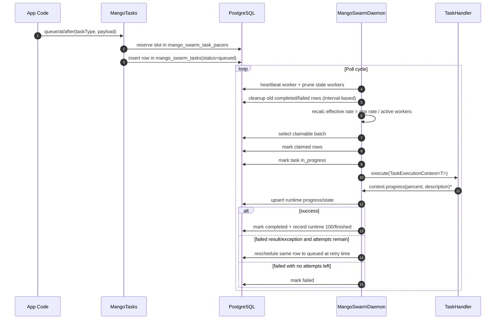
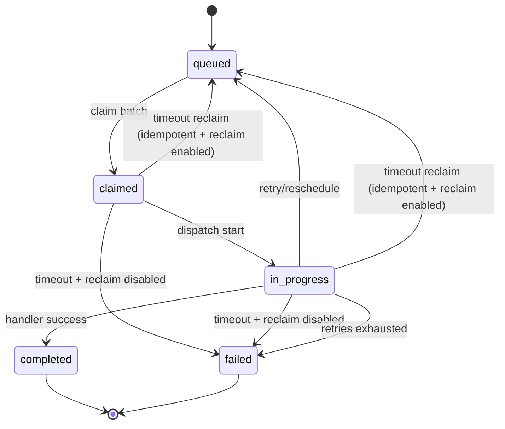

# How mango-swarm Works

This document explains the runtime model of `mango-swarm`, the table interactions, and the control flow from task submission to completion.

## Scope and assumptions

- Multiple instances of the same application can run at the same time.
- All instances support the same configured task types.
- Task payloads are durable JSON (`jsonb`) and can outlive Java POJO versions.
- The application owns schema and table creation. The library does not run migrations from its jar.

## Core components

- `MangoTasks`: high-level API for `queue(...)`, `at(...)`, and `after(...)`.
- `MangoSwarmDaemon`: worker loop that heartbeats, claims, dispatches, retries, reclaims, and cleans up old terminal tasks.
- `TaskHandler<T>`: application task logic.
- `TaskExecutionContext<T>`: metadata + payload + progress reporting callback.
- `TaskRepository`: PostgreSQL persistence contract used by the daemon.
- `WorkerRegistry`: worker heartbeat and active-worker counting.

## Data model

Required tables:

- `mango_swarm_workers`
  - worker identity and heartbeats (`worker_id`, `last_heartbeat_at`, etc.)
- `mango_swarm_tasks`
  - durable work item and lifecycle fields
- `mango_swarm_task_runtime`
  - mutable execution state, progress, and liveness fields
  - includes `execution_state`, `progress_percent`, `progress_message`, and `updated_at`
- `mango_swarm_task_pacers`
  - per-task-type slot occupancy ledger used for smooth scheduling

Reference SQL:

- `documentation/mango-swarm-schema.sql`

## End-to-end runtime flow

`*` progress calls are optional but strongly recommended for long-running handlers.

## Task state lifecycle

## Scheduling model

`MangoTasks` schedules by slot spacing derived from task-type `rate` and `period`:

- `slotSpacing = period / rate` (bounded to at least 1ns)

When queueing:

1. Check nearest occupied slot at or before requested time.
2. Check nearest occupied slot after requested time.
3. Move requested time forward only when needed to avoid slot collisions.

Result: a far-future task does not block earlier tasks.

## Distributed rate division

Each task type has app-level rate config. A worker applies:

- `effectiveLocalRate = configuredRate / activeWorkerCount`

`activeWorkerCount` comes from worker heartbeats in `mango_swarm_workers`.

The daemon uses smooth slot pacing and batch claiming, not burst-all-at-once permits.

## Batch claiming and concurrency

For each task type and poll cycle, claim limit is bounded by:

- configured/derived batch size
- remaining local rate capacity
- remaining per-task-type concurrency
- remaining global executor capacity

Claiming uses a portable select-and-update flow so repository behavior can be validated against H2. PostgreSQL-specific concurrent row-lock claiming is outside the H2 test surface.

## Progress and liveness

Handlers receive `TaskExecutionContext<T>` and can call:

- `progress(percent)`
- `progress(percent, description)`
- `updateState(state)`
- `updateProgress(percent, description)`

`TaskExecutionContext<T>` contains:

- `taskId`: persisted task UUID from `mango_swarm_tasks.id`
- `taskType`: configured task type key
- `workerId`: worker UUID executing the attempt
- `attemptCount`: current attempt number
- `claimedAt`: claim timestamp for the current attempt
- `payload`: extracted typed payload

Effects of each call:

- upserts the task's row in `mango_swarm_task_runtime`
- updates `execution_state` when provided
- updates `progress_percent` and `progress_message` when provided
- updates runtime `updated_at`

Timeout reclaim checks:

- `COALESCE(mango_swarm_task_runtime.updated_at, mango_swarm_tasks.claimed_at)`

So progress calls extend the reclaim silence window.

On successful completion, the library records:

- runtime `execution_state = completed`
- runtime `progress_percent = 100`
- runtime `progress_message = finished`

Handlers should return `TaskExecutionResult.completed()` for success or `TaskExecutionResult.failed(message)` for an explicit failure. A `null` result is still treated as success for compatibility, but new handlers should not rely on that behavior.

## Retries and reclaim

Failure retry:

- same row is rescheduled (`status=queued`, `available_at=retryAt`)
- delay uses exponential backoff (global defaults + per-task overrides)

Timeout reclaim:

- only requeues when:
  - `reclaim-on-timeout = true`
  - `idempotent = true`
- otherwise timeout path marks tasks as failed

## Cleanup task

The daemon also runs a built-in retention cleanup pass. No application `TaskHandler` is required.

Cleanup config:

- `mango.swarm.cleanup.enabled` (default `true`)
- `mango.swarm.cleanup.interval` (default `10m`)
- `mango.swarm.cleanup.completed-retention` (default `30d`)
- `mango.swarm.cleanup.failed-retention` (default `90d`)
- `mango.swarm.cleanup.pacer-retention` (default `30d`)
- `mango.swarm.cleanup.batch-size` (default `1000`)

Cleanup behavior:

- delete from `mango_swarm_tasks` where `status='completed'` and `completed_at < now - completed-retention`
- delete from `mango_swarm_tasks` where `status='failed'` and `failed_at < now - failed-retention`
- delete from `mango_swarm_task_pacers` where `slot_at < now - pacer-retention`
- each cleanup category deletes at most `batch-size` rows per pass
- never deletes `queued`, `claimed`, or `in_progress` rows

This keeps the task table bounded while preserving recent execution history for diagnostics.

## Threading model

- Global executor capacity is independent of per-task-type concurrency.
- Per-task-type concurrency caps a single type.
- Global pool caps total parallel work on the worker.
- The `virtual-threads` setting is reserved for future Java 21+ runtime support; current builds use platform threads while keeping Java 17 as the compile baseline.

## What application teams own

- Schema creation and selection.
- Table creation and migration lifecycle.
- Task handler implementations.
- Task-type config (`rate`, `period`, `concurrency`, `timeout`, retries, reclaim/idempotency).
